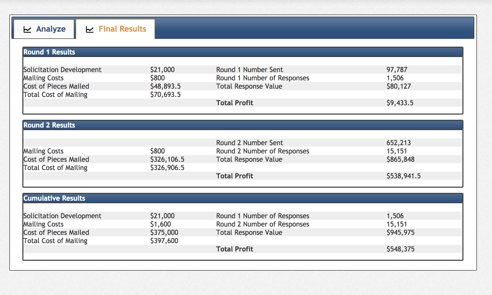

* Team-lead gitlab id: rsm-sehughes
* Group number: 13
* Group name: Team 13
* Team member names: Sam Hughes, Yizhen Lou, Yu-Wei Tang, Yuyan Wang 

```{r r_setup, include = FALSE}
## initial settings
knitr::opts_chunk$set(
  comment = NA,
  echo = TRUE,
  error = TRUE,
  cache = FALSE,
  message = FALSE,
  dpi = 96,
  warning = FALSE
)

## width to use when printing tables etc.
options(
  width = 250,
  scipen = 100,
  max.print = 5000,
  stringsAsFactors = FALSE
)

## load libraries
library(radiant)
```

<style>
.table {
  width: auto;
}
ul, ol {
  padding-left: 18px;
}
pre, code, pre code {
  overflow: auto;
  white-space: pre;
  word-wrap: normal;
  background-color: #ffffff;
}
</style>

```{r}
# load datasets

fp <- radiant.data::find_dropbox()
exhibit1 <- readxl::read_excel(file.path(fp, "MGTA455-2019/data/exhibits.xlsx"), sheet = "exhibit1")
exhibit2 <- readxl::read_excel(file.path(fp, "MGTA455-2019/data/exhibits.xlsx"), sheet = "exhibit2")
```

# Preparation questions:

## 1. 

From Exhibit 2, we can see that for all kinds of offers, customers with a BK score of 150 have the highest Lifetime Customer Value and customers with a BK score of 250 have the lowest Lifetime Customer Value. An individual’s BK score was a measure of risk--the higher the score, the more likely that person was to default on a financial obligation--so in general, people with low BK score have less chance of bankruptcy. They are more likely to pay their credit card and thus generate more value for bank. So Lifetime Customer Value is inversly related to BK score.

Lifetime Customer Value also varies with product. APR (annual percentage rate) is the rate of interest charged on outstanding balances. So the higher APR is, the larger Lifetime Customer Value for bank; a direct relationship. 

Annual fee is the fixed annual fee paid by the cardholder. So annual fee of $20 will generate more money for bank than no annual fee. We see a direct relationship between annual fee and CLV.

For fixed rate and variable rate cards, customers with fixed rates will always have a fixed interest rate. But for variable rate cards, interest rates will change with the prevailing prime interest rate. From the data in Exhibit 2, we see that Liftime Customer Value slightly increases for Variable rate cards. 


## 2. 

We used the historical data (Exhibit 1) to train a Logistic model to predict the response rate for each of the 36 difference senarios. But this predicted response rate was only used to determine sample size we need to use during more controlled experiment. We didn't use this predictive model for our roll out because the data is not distributed evenly enough. For a quality experiment, we want to have an even number of each of the variable's options before boosting the data to avoid any biases. Additionally, the two variablse, date and visamc, may influence response rate, but we don't have any information about these variables for the current 750,000 customers. So a more controlled experiment will provide better data for us to gain more insights before our official rollout.

## 3.

We did not find a single card that we expected to produce the highest profits across all three customer groups but the best card for the BK score groups of 200 and 250 was the same. This was the 19.8% APR offer with a fixed rate and no annual fee. For our round two, we did end up sending this offer to the 200 and 250 groups but not the 150 group because another card was expected to perform better. However, if uniformity was desired we could have sent this card to all the customers in round 2 because this card was ranked 5th in order of expected lifetime profits, which is better than most offers. This card had a very high CLV accross each group but does not have a high enough response rate for the 150 group.

## 4.

Our initial strategy after seeing the historical data in Exhibit 1 was to use that data, boost it and create a classification model to predict a response rate for each of the 36 differnent scenearios. Those 36 scenarios arising from the 12 card options combinations we could send to the three different customer groups.

```{r}
# original logisitic regression model

exhibit1 <- exhibit1 %>% mutate(res_rate = resp/nr_mailed)
exhibit1_gathered <- gather(exhibit1, response, freq, non_resp, resp, factor_key = TRUE)
exhibit1_gathered$freq <- exhibit1_gathered$freq/10

## Boost each row based on freq of each row

exhibit1_gathered_dat <- select(exhibit1_gathered, date, apr, fixed_var, annual_fee, visamc, nr_mailed, bk_score, average_bk, response, freq) %>%
  table2data("freq")

## Change datatype to factor

exhibit1_gathered_dat <- exhibit1_gathered_dat %>%
  mutate(apr = as.factor(apr),
         fixed_var = as.factor(fixed_var),
         annual_fee = as.factor(annual_fee),
         bk_score = as.factor(bk_score))

## Train logistic model with interaction
Model <- logistic(
  exhibit1_gathered_dat,
  rvar = 'response',
  evar = c('apr','fixed_var','annual_fee','bk_score'),
  lev = "resp",
  int = c(
    "apr:fixed_var", "apr:annual_fee",
    "apr:bk_score", "fixed_var:annual_fee",
    "fixed_var:bk_score",
    "annual_fee:bk_score",
    "apr:fixed_var:annual_fee",
    "apr:fixed_var:bk_score",
    "apr:annual_fee:bk_score",
    "fixed_var:annual_fee:bk_score"
  )
)

summary(Model)
## Create dataframe for all combination
testing2 <- data.frame(
  "apr" = as.factor(rep(c(14.9, 16.8, 19.8), each = 12)),
  "fixed_var" = as.factor(rep(c("Fixed", "Variable"), each = 6, 3)),
  "annual_fee" = as.factor(rep(c(0, 20), each = 3, 6)),
  "bk_score" = as.factor(rep(c(150, 200, 250), 12))
)

## Project prediction on it
pred <- predict(Model, testing2)

knitr::kable(select(pred, apr, fixed_var, annual_fee, bk_score, Prediction), caption = "Logistic Model Trained on Exhibit 1 Data")
```

After building a logistic model however, we realized that the historical data was not fit to be boosted and used to train a classification model because it had poorly distributed examples of the effect of each other the variable factors of a card. For example, it had 12 instances of fixed rate cards being promoted and only 2 of variable rates. So we decied to used this model to come up with a soft predition for the 36 different scenarios and use design->sample size single tool in radiant to estimate the minimum sample size we could use to get more reasonable, evenly distributed data to build a better model. For each senario, we entered our soft prediction, an acceptable error of 10% of that prediction and a confidence interval of 90%. We then recoreded the resulting sample size.


```{r}
result <- doe(
  factors = c(
    "apr; 14.9; 16.8; 19.8", 
    "fixed_var; Fixed; Variable", 
    "annual_fee; 0; 20", 
    "bk_score; 150; 200; 250"
  ), 
  seed = 1220
)
summary(result, eff = TRUE, part = FALSE, full = FALSE)
```

No matter what value of seed we set, trials = 12 can always gives us a balanced partial factorial design with relatively low D-efficiency. So we decide to do experiment with 12 trials. 

Next, we picked 12 senarios, using radiant's experiment design tool, to run a partial factorial design experiment. We ran this experiment in Round one using a total of nearly 100,000 customers.

```{r}
design <- doe(
  factors = c(
    "apr; 14.9; 16.8; 19.8", 
    "fixed_var; Fixed; Variable", 
    "annual_fee; 0; 20", 
    "bk_score; 150; 200; 250"
  ), 
  trials = 12, 
  seed = 1234
)
summary(design, eff = FALSE, part = TRUE, full =FALSE)
```


```{r}
# code for calculating sample size
design_experiment <- design$part
# Projected expected response rate on partial factorial experiment for futher usage
design_experiment$pred <- predict(Model, design_experiment)$Prediction

# Calculate sample size to send depending on response rate and error we accpeted in each combination.
design_experiment <- design_experiment %>%
  mutate(
    nsample = ifelse(pred <0.02,sample_size(     
      # To avoid unwanted waste on sample size, for response rate lower than 0.02, we accpet response_rate/5 error
      type = "proportion",
      p_prop = pred,
      err_prop = pred/5,
      pop_correction = "yes",
      pop_size = 25000
    )$n,
    sample_size(                                # For others we expect response_rate/10 error
      type = "proportion",
      p_prop = pred,
      err_prop = pred/10,
      pop_correction = "yes",
      pop_size = 25000
    )$n))
knitr::kable(select(design_experiment, -trial), caption = "Senario Sample Sizes")
```

Next, the resulting data from that experiment was boosted and used to train a number of classification models including Logisitic and Neural Network.

```{r}
result2 <- read.csv('result.csv')

## create new variable(s)
result2 <- mutate(result2, non_res = sent - response)
## Gather columns
result_gathered <- gather(result2, response, freq, response, non_res, factor_key = TRUE)
## register the new dataset
register("result_gathered", "result")
## Create data from a table
result_gathered_dat <- select(result_gathered, apr, fixed_var, annual_fee, bk_score, sent, response, freq) %>%
  table2data("freq")
## register the new dataset
register("result_gathered_dat", "result_gathered")

boosted1 <- write.csv(result_gathered_dat, file = "result_data.csv")
```

```{r}
# code to build new logistic model

## all 36 combinations 
testing2 <- data.frame(
  "apr" = as.factor(rep(c(14.9, 16.8, 19.8), each = 12)),
  "fixed_var" = as.factor(rep(c("Fixed", "Variable"), each = 6, 3)),
  "annual_fee" = as.factor(rep(c(0, 20), each = 3, 6)),
  "bk_score" = as.factor(rep(c(150, 200, 250), 12))
)

result <- logistic(
  result_gathered_dat, 
  rvar = "response", 
  evar = c("apr", "fixed_var", "annual_fee", "bk_score"), 
  lev = "response"
)
summary(result)
pred <- predict(result, pred_data = testing2)
#print(pred, n = 10)
testing2 <- store(testing2, pred, name = "pred_logit")

## ranking of the best 
exhibit2 <- exhibit2 %>%
  gather(bk_score, ltv, ltv150:ltv250)

exhibit2$bk_score <- ifelse(exhibit2$bk_score=='ltv150', 150, ifelse(exhibit2$bk_score=='ltv200', 200, 250))
exhibit2$apr <- as.factor(exhibit2$apr)
exhibit2$annual_fee <- as.factor(exhibit2$annual_fee)
exhibit2$bk_score <- as.factor(exhibit2$bk_score)

testing2 <- testing2 %>% left_join(exhibit2 ,by = c('apr', 'fixed_var', 'annual_fee', 'bk_score'))

testing2$exp_ltv <- testing2$pred_logit*testing2$ltv


plan150 <- testing2 %>% filter(bk_score == 150) %>% arrange(desc(exp_ltv)) %>% slice(1)
plan200 <- testing2 %>% filter(bk_score == 200) %>% arrange(desc(exp_ltv)) %>% slice(1)
plan250 <- testing2 %>% filter(bk_score == 250) %>% arrange(desc(exp_ltv)) %>% slice(1)
best <- rbind(plan150, plan200, plan250)

knitr::kable(best, caption = "Best Senario for Each BK Score Group")
```

```{r}
## calculate rmse
pred12<- predict(result, pred_data = result_gathered_dat)
result2$res_rate <-result2$response/result2$sent
result2$annual_fee <- as.factor(result2$annual_fee)
result2$apr <- as.factor(result2$apr)
result2$bk_score <- as.factor(result2$bk_score)

pred12 <- pred12 %>%
  group_by(apr, fixed_var, annual_fee, bk_score) %>%
  summarise(pred_rate = mean(Prediction))

compare <- pred12 %>%
  left_join(result2, by = c('apr', 'fixed_var', 'annual_fee', 'bk_score'))

sum((compare$pred_rate-compare$res_rate)^2)/12
```




Our plan over all resulted in a total response value of \$945,975 and a resulting profit of \$548,375. We increased our response rate from round 1, which was `r format_nr(150600 / 97787, dec = 2)`%, to `r format_nr(1515100 / 652213, dec = 2)`% in round 2, indicating our analysis and prediction added value. Additionally, the response value per response increased from \$`r format_nr(80127 / 1506, dec = 2)`, to \$`r format_nr(865848 / 15151, dec = 2)` indicating that the targeting increased the average CLV of our customer base. 


